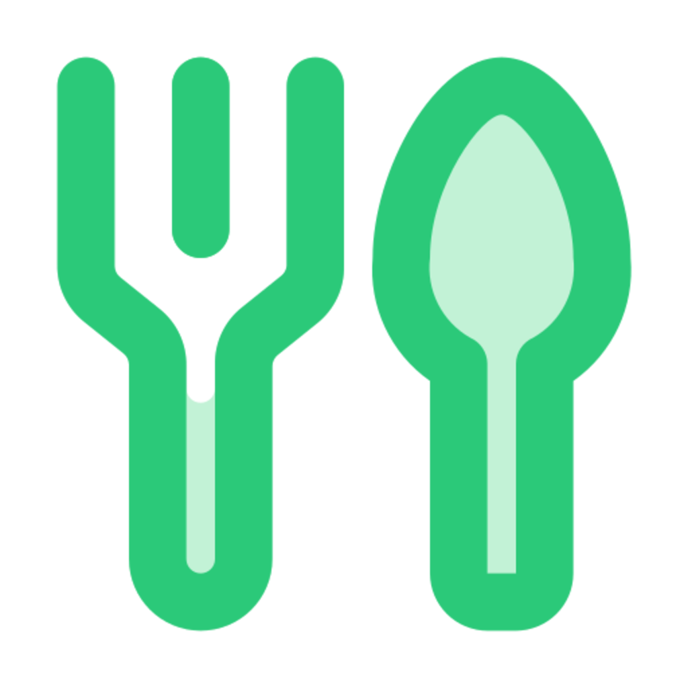

# NutritionAI Mobile 📱

A comprehensive React Native mobile application for tracking daily nutrition intake with AI-powered food analysis using image recognition. Built with Expo and TypeScript.

<div align="center">
  
  
  <p><em>✨ Recently updated with beautiful new app icons and enhanced user experience!</em></p>

  <!-- First row of 3 images -->
  <div style="display: flex; justify-content: center; gap: 10px; margin: 10px 0;">
    
    
    
  </div>

  <!-- Second row of 3 images -->
  <div style="display: flex; justify-content: center; gap: 10px; margin: 10px 0;">
    
    
    
  </div>

  [](https://expo.dev/)
  [](https://reactnative.dev/)
  [](https://www.typescriptlang.org/)
  [](https://opensource.org/licenses/MIT)
</div>


## ✨ Features

* 🍎 **Smart Food Tracking**: Log meals with detailed nutritional information
* 📸 **AI Image Analysis**: Analyze food photos using OpenRouter AI (Google Gemini 2.5 Flash)
* 💧 **Water Intake Tracking**: Monitor daily hydration goals with visual progress
* 📊 **Analytics & Statistics**: Visualize nutrition trends with interactive charts
* 🎯 **Goal Setting**: Set and track personalized nutrition and hydration goals
* 👤 **User Profiles**: Manage personal information and health preferences
* 📱 **Cross-Platform**: Works on both iOS and Android devices
* 🔒 **Secure Storage**: API keys and sensitive data stored securely with Expo SecureStore  
* 🌙 **Modern UI**: Beautiful interface built with React Native Paper
* 📈 **Progress Tracking**: Monitor daily, weekly, and monthly nutrition progress
* 🎨 **Professional Branding**: Custom-designed app icons optimized for all platforms

## 🛠 Technology Stack

* **Framework**: React Native with Expo SDK 52
* **Language**: TypeScript
* **Navigation**: Expo Router (File-based routing)
* **UI Components**: React Native Paper (Material Design 3)
* **Charts**: React Native Chart Kit
* **Database**: Expo SQLite (Local storage)
* **Secure Storage**: Expo SecureStore
* **AI Integration**: OpenRouter API with Google Gemini 2.5 Flash
* **Image Processing**: Expo Image Picker & Camera
* **Date Management**: date-fns
* **HTTP Client**: Axios

## 📋 Prerequisites

* Node.js 18 or higher
* npm or Yarn package manager
* Expo CLI (`npm install -g @expo/cli`)
* OpenRouter API key (for AI food analysis)
* iOS Simulator (macOS) or Android Emulator
* Expo Go app (for physical device testing)

## 🚀 Installation

### 1. Clone the repository
```bash
git clone https://github.com/ClaudiuJitea/NutritionAI-mobile.git
cd NutritionAI-mobile
```

### 2. Install dependencies
```bash
# Using npm
npm install

# Using yarn
yarn install
```

### 3. Set up environment variables
```bash
# Copy the example environment file
cp .env.example .env

# Edit .env with your actual values
# Get your OpenRouter API key from: https://openrouter.ai/
```

### 4. Start the development server
```bash
# Using npm
npm start

# Using yarn
yarn start

# Or start directly with Expo
npx expo start
```

### 5. Run on device/simulator
```bash
# iOS Simulator (macOS only)
npx expo run:ios

# Android Emulator
npx expo run:android

# Or scan QR code with Expo Go app
```

## ⚙️ Configuration

### OpenRouter API Setup

1. Visit [OpenRouter.ai](https://openrouter.ai/)
2. Create an account and get your API key
3. The app will prompt you to enter your API key on first launch
4. API keys are stored securely using Expo SecureStore

### Environment Variables

Create a `.env` file in the root directory:

```env
# OpenRouter API Configuration
OPENROUTER_API_KEY=your-openrouter-api-key-here

# App Configuration
EXPO_PROJECT_ID=your-expo-project-id-here
```

## 📱 Usage

### Getting Started

1. **Launch the App**: Open the app on your device or simulator
2. **Complete Onboarding**: Set up your profile, goals, and API key
3. **Start Tracking**: Begin logging food and water intake
4. **View Analytics**: Monitor your progress in the Analytics tab

### Core Features

#### 🍽️ Food Tracking
- **Manual Entry**: Add food items with custom nutritional information
- **AI Photo Analysis**: Take photos of meals for automatic analysis
- **Meal Categories**: Organize by breakfast, lunch, dinner, or snacks
- **Food Categories**: Automatic categorization (vegetables, fruits, grains, protein, dairy)

#### 💧 Hydration Tracking
- **Water Goals**: Set daily water intake targets
- **Quick Logging**: Fast buttons for common serving sizes
- **Progress Visualization**: Circular progress indicators
- **Custom Amounts**: Add custom water amounts

#### 📊 Analytics & Statistics
- **Daily Summaries**: Calorie and macro-nutrient breakdowns
- **Progress Charts**: Line charts for trends over time
- **Goal Achievement**: Visual indicators for daily goals
- **Category Distribution**: Pie charts for food category analysis

#### ⚙️ Settings & Preferences
- **Profile Management**: Update personal information
- **Goal Customization**: Adjust nutrition and hydration targets
- **API Key Management**: Update or remove OpenRouter API key
- **Data Management**: Clear app data if needed

## 🏗️ Project Structure

```
src/
├── app/                     # Expo Router pages
│   ├── (tabs)/             # Tab navigation screens
│   │   ├── index.tsx       # Dashboard/Home
│   │   ├── food.tsx        # Food log
│   │   ├── food-analysis.tsx # AI food analysis
│   │   ├── water.tsx       # Water tracking
│   │   └── analytics.tsx   # Statistics
│   ├── _layout.tsx         # Root layout
│   ├── onboarding.tsx      # Initial setup
│   ├── settings.tsx        # App settings
│   └── manual-food-entry.tsx # Manual food entry
├── src/
│   ├── components/         # Reusable components
│   ├── constants/          # App constants and themes
│   ├── services/           # API services and database
│   │   ├── database.ts     # SQLite database operations
│   │   └── openrouter.ts   # OpenRouter AI service
│   └── types/              # TypeScript type definitions
│       ├── api.ts          # API response types
│       └── database.ts     # Database schema types
├── assets/                 # Static assets
└── app.json               # Expo configuration
```

## 🔧 Development

### Running in Development
```bash
# Start the development server
npm start

# Run on iOS simulator
npm run ios

# Run on Android emulator
npm run android

# Run on web (for testing)
npm run web
```

### Building for Production
```bash
# Build development build
npx expo build

# For production deployment, configure EAS Build
npx eas build --platform ios
npx eas build --platform android
```

### Database Schema

The app uses SQLite with the following main tables:
- **users**: User profiles and preferences
- **food_entries**: Individual food log entries
- **water_entries**: Water intake records
- **nutrition_goals**: User-defined nutrition targets

## 🔒 Privacy & Security

* **Local Data Storage**: All personal data stored locally on device
* **Secure API Keys**: OpenRouter API keys stored with Expo SecureStore
* **No Data Collection**: No personal data sent to external servers (except OpenRouter for AI analysis)
* **Offline Capable**: Core functionality works without internet connection

## 🤝 Contributing

1. Fork the repository
2. Create a feature branch (`git checkout -b feature/amazing-feature`)
3. Commit your changes (`git commit -m 'Add some amazing feature'`)
4. Push to the branch (`git push origin feature/amazing-feature`)
5. Open a Pull Request

### Development Guidelines

* Follow TypeScript best practices
* Use React Native Paper components for consistency
* Write meaningful commit messages
* Test on both iOS and Android platforms
* Ensure accessibility compliance

## 📦 Building & Deployment

### Expo Application Services (EAS)

1. **Install EAS CLI**
```bash
npm install -g eas-cli
```

2. **Configure EAS**
```bash
eas build:configure
```

3. **Build for App Stores**
```bash
# iOS App Store
eas build --platform ios --profile production

# Google Play Store
eas build --platform android --profile production
```

4. **Submit to Stores**
```bash
eas submit --platform ios
eas submit --platform android
```

## 📄 License

This project is licensed under the MIT License - see the [LICENSE](LICENSE) file for details.

## 🙏 Acknowledgments

* [OpenRouter.ai](https://openrouter.ai/) for AI-powered food analysis
* [Google Gemini](https://deepmind.google/technologies/gemini/) for advanced image recognition
* [Expo](https://expo.dev/) for the amazing development platform
* [React Native Paper](https://callstack.github.io/react-native-paper/) for beautiful UI components
* [React Native Chart Kit](https://github.com/indiespirit/react-native-chart-kit) for data visualization

## 📞 Support

If you encounter any issues or have questions:

1. Check the [Issues](https://github.com/ClaudiuJitea/NutritionAI-mobile/issues) page
2. Create a new issue with detailed information
3. Include screenshots and device information
4. Specify steps to reproduce the problem

## 🔄 Updates & Changelog

### Version 1.1.1 - Latest 🆕
- 🐛 **Critical Bug Fix**: Fixed non-working buttons in Settings page (Save Key, Test Connection, Save Settings)
- ⚡ **Improved Responsiveness**: Changed input components from uncontrolled to controlled for immediate state updates
- 🔧 **Better UX**: Buttons now respond immediately as you type, no need to click away from inputs

### Version 1.1.0
- ✨ **Brand New App Icons**: Beautiful, professionally designed icons for all platforms
- 🎨 **Enhanced Visual Identity**: Updated app branding with modern iconography
- 🚀 **Improved Performance**: Removed splash screen for faster app startup
- 🔧 **Better UX**: Fixed TextInput focus issues in Settings page
- 👁️ **Enhanced Security**: Added API key visibility toggle for better user control
- 📱 **Store Ready**: Optimized icons for App Store and Google Play submissions

### Version 1.0.0
- Initial release
- AI-powered food analysis
- Water intake tracking
- Comprehensive analytics
- Cross-platform compatibility

---

**Made with ❤️ for healthier living**

> **Note**: This application requires an OpenRouter API key for AI features. The free tier provides sufficient usage for personal projects. For production use, consider the usage limits and pricing at [OpenRouter.ai](https://openrouter.ai/).
